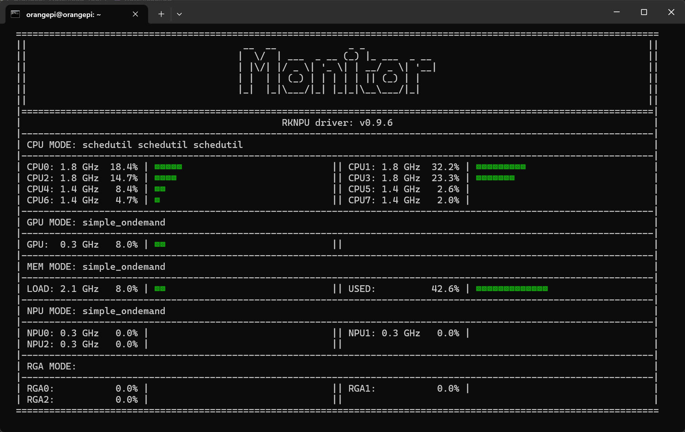

# watchload for 3588/3588s
The project is mainly designed to conveniently view information about the devices(CPU/GPU/RGA/NPU/MEM), and provide the ability to switch between different modes of operation for the devices.



## Highlights
 - Monitor support automatically adjust the size base on the console window size.
 - Monitor support customize the devices being monitored.
 - Support device mode quick switching between performance/ondemand/powersave.

## How to use
```bash
Options:
    -h, --help      show the help message
    -s, --show      show options   (combination of c,g,n,r,m)
                    set the device information and display order in the monitor(cpu/gpu/npu/rga/memory), default is cgmnr
    -n, --interval  interval time  (number)
                    set the refresh interval time (seconds) of the monitor, default is 1
    -m, --mode      mode selection (ondemand/performance/powersave/none)
                    set the mode of the cpu/gpu/npu/memory, default is none

Examples:
    watchload -s cgmn -n 2
    watchload --mode performance
```

## How to build
```bash
git clone https://github.com/BlueBrightWind/watchload-for-rk3588.git --depth=1 watchload
cd watchload
sudo apt install python3-pip
pip3 install pyinstaller psutil
pyinstaller watchload.py
```

## Why the script need sudo permissions
 - Only sudo users can modify device mode
 - Viewing the load of some devices requires sudo permissions(devices in /sys/kernel/debug/**)

## Acknowledgments
The project is based on: https://github.com/Tang-JingWei/watchload-for-rk3588
